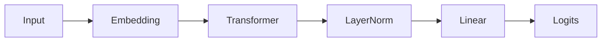

# GPT2

## 概要

```mermaid
flowchart LR

Input --> Embedding
Embedding --> Transformer
Transformer --> LayerNorm
LayerNorm --> Linear
Linear --> Logits
```

## Attention Mechanism（注意力机制）

The attention score is

$$
\mathrm{Attention}(Q,K,V)
=
\mathrm{softmax}
\left(
\frac{QK^T}{\sqrt{d_k}}
\right)
V
$$

## Multi Head Attention（多头注意力）

